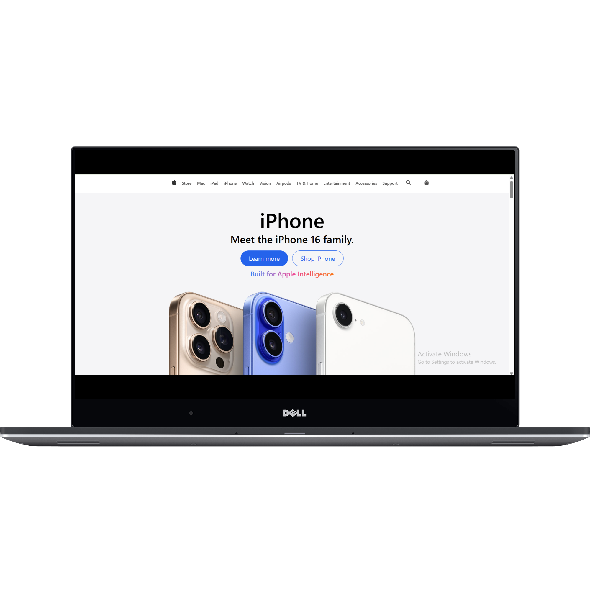

# 🍎 Apple Clone

### About Project
A fully responsive **Apple.com homepage clone** built using **React.js** and **Tailwind CSS**, replicating Apple's sleek layout and smooth visual design. The app adapts seamlessly to different screen sizes—optimized for both **mobile** and **desktop** devices.

---

### 🧱 Tech Stack

- ⚛️ React.js  
- 💨 Tailwind CSS  
- 🧭 React Router  
- 💻 Responsive design (Mobile & Desktop)

---

### ✨ Features

- Accurate layout replication of Apple homepage
- Multiple content sections built using reusable components
- Fully responsive grid and flexbox layout
- Clean UI with modern animations and transitions
- Section cards with dynamic styling and spacing

---

 Live Demo
https://apple-replica-sigma.vercel.app/
